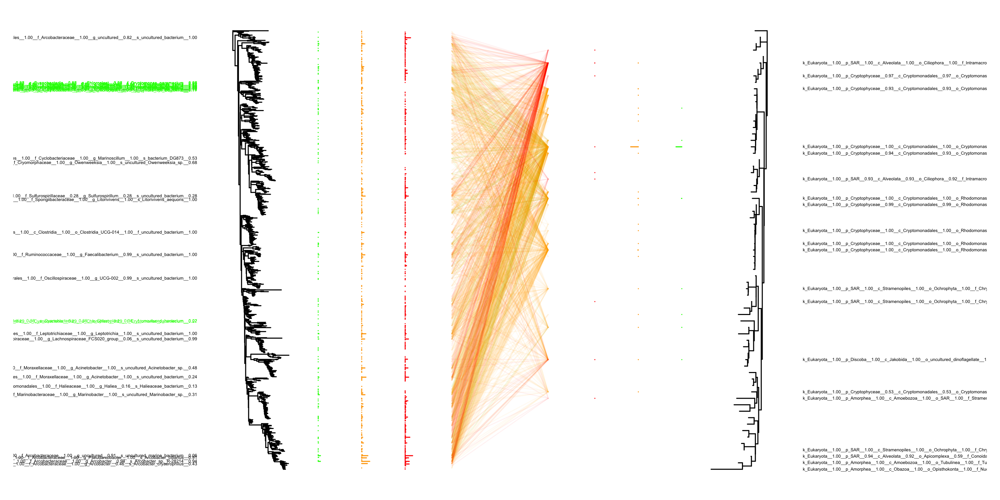
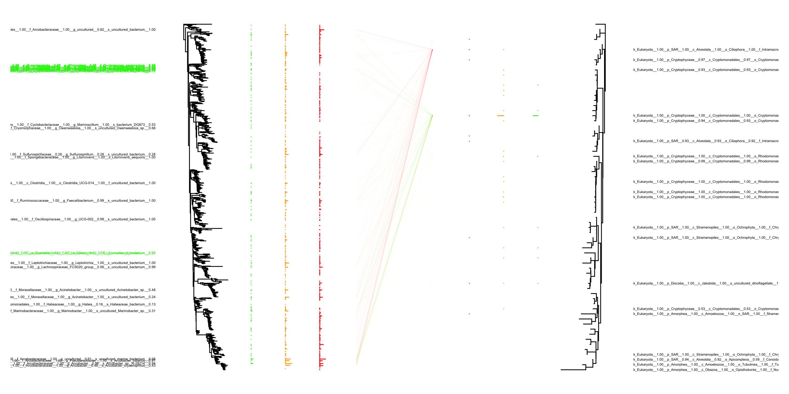
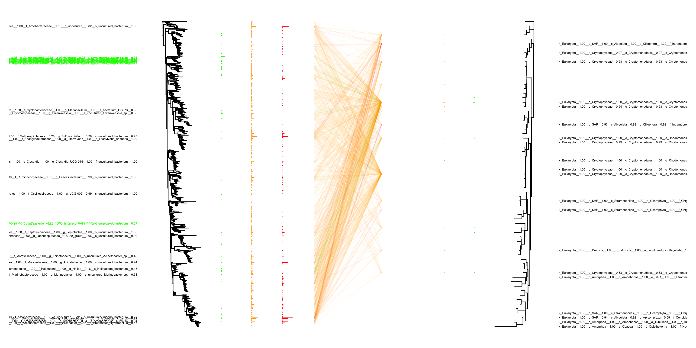
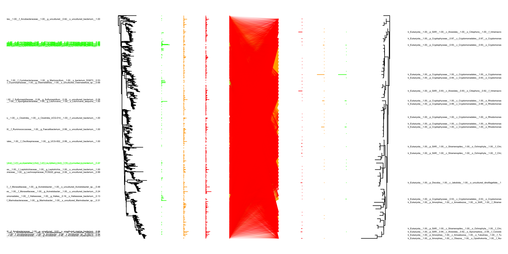
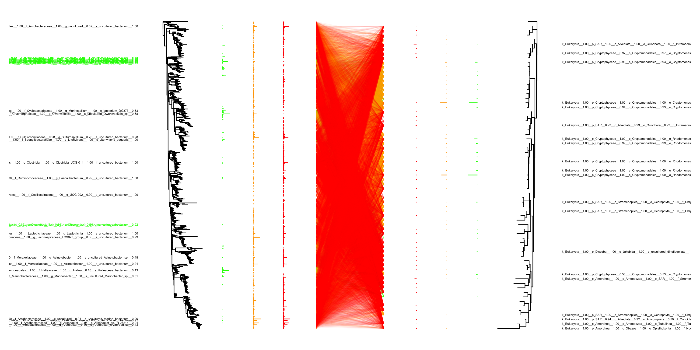
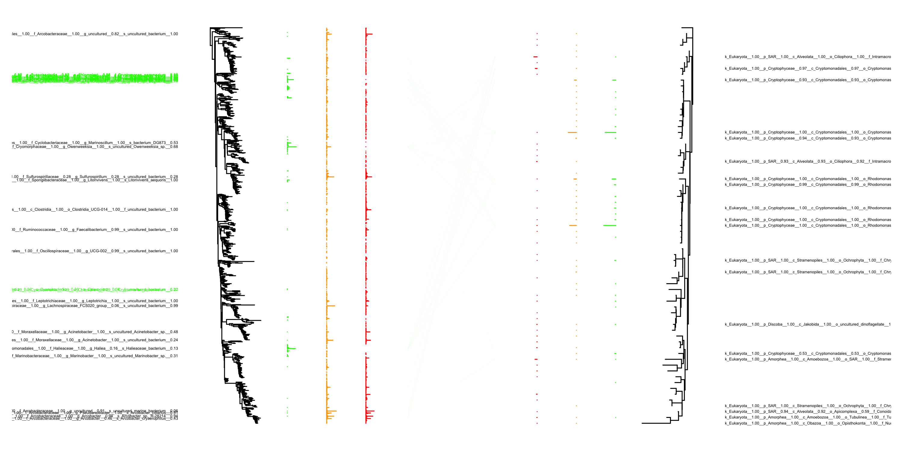

## Samples

<table>
<thead>
<tr class="header">
<th style="text-align: left;">Sample name</th>
<th style="text-align: left;">Samply type</th>
</tr>
</thead>
<tbody>
<tr class="odd">
<td style="text-align: left;">BiolstdMockMag16S</td>
<td style="text-align: left;">Biological standard</td>
</tr>
<tr class="even">
<td style="text-align: left;">BiolstdMockMag18S</td>
<td style="text-align: left;">Biological standard</td>
</tr>
<tr class="odd">
<td style="text-align: left;">BiolstdMockNomag16S</td>
<td style="text-align: left;">Biological standard</td>
</tr>
<tr class="even">
<td style="text-align: left;">BiolstdMockNomag18S</td>
<td style="text-align: left;">Biological standard</td>
</tr>
<tr class="odd">
<td style="text-align: left;">BiolstdNomockMag16S</td>
<td style="text-align: left;">Biological standard</td>
</tr>
<tr class="even">
<td style="text-align: left;">BiolstdNomockMag18S</td>
<td style="text-align: left;">Biological standard</td>
</tr>
<tr class="odd">
<td style="text-align: left;">BiolstdNomockNomag16S</td>
<td style="text-align: left;">Biological standard</td>
</tr>
<tr class="even">
<td style="text-align: left;">BiolstdNomockNomag18S</td>
<td style="text-align: left;">Biological standard</td>
</tr>
<tr class="odd">
<td style="text-align: left;">BiolstdWWMockMag16S</td>
<td style="text-align: left;">WW + Biological standard</td>
</tr>
<tr class="even">
<td style="text-align: left;">BiolstdWWMockMag18S</td>
<td style="text-align: left;">WW + Biological standard</td>
</tr>
<tr class="odd">
<td style="text-align: left;">BiolstdWWMockNomag16S</td>
<td style="text-align: left;">WW + Biological standard</td>
</tr>
<tr class="even">
<td style="text-align: left;">BiolstdWWMockNomag18S</td>
<td style="text-align: left;">WW + Biological standard</td>
</tr>
<tr class="odd">
<td style="text-align: left;">BiolstdWWNomockMag16S</td>
<td style="text-align: left;">WW + Biological standard</td>
</tr>
<tr class="even">
<td style="text-align: left;">BiolstdWWNomockMag18S</td>
<td style="text-align: left;">WW + Biological standard</td>
</tr>
<tr class="odd">
<td style="text-align: left;">BiolstdWWNomockNomag16S</td>
<td style="text-align: left;">WW + Biological standard</td>
</tr>
<tr class="even">
<td style="text-align: left;">BiolstdWWNomockNomag18S</td>
<td style="text-align: left;">WW + Biological standard</td>
</tr>
<tr class="odd">
<td style="text-align: left;">WWMockMag16S</td>
<td style="text-align: left;">WW</td>
</tr>
<tr class="even">
<td style="text-align: left;">WWMockMag18S</td>
<td style="text-align: left;">WW</td>
</tr>
<tr class="odd">
<td style="text-align: left;">WWMockNomag16S</td>
<td style="text-align: left;">WW</td>
</tr>
<tr class="even">
<td style="text-align: left;">WWMockNomag18S</td>
<td style="text-align: left;">WW</td>
</tr>
<tr class="odd">
<td style="text-align: left;">WWNomockMag16S</td>
<td style="text-align: left;">WW</td>
</tr>
<tr class="even">
<td style="text-align: left;">WWNomockMag18S</td>
<td style="text-align: left;">WW</td>
</tr>
<tr class="odd">
<td style="text-align: left;">WWNomockNomag16S</td>
<td style="text-align: left;">WW</td>
</tr>
<tr class="even">
<td style="text-align: left;">WWNomockNomag18S</td>
<td style="text-align: left;">WW</td>
</tr>
</tbody>
</table>

## Barcode distributions

<table>
<tr>
<td>
Barcode distribution
</td>
<td>
Barcode taxonomy distribution
</td>
</tr>
<tr>
<td valign="top">

</td>
<td valign="top">

</td>
</tr>
</table>

## Distribution of connections

<td valign="top">

</td>

## Abundance profiles

The abundance columns are:

-   BiolstdMockMag
-   BiolstdWWMockMag
-   WWMockMag
-   BiolstdMockNomag
-   BiolstdWWMockNomag
-   WWMockNomag
-   BiolstdNomockMag
-   BiolstdWWNomockMag
-   WWNomockMag
-   BiolstdNomockNomag
-   BiolstdWWNomockNomag
-   WWNomockNomag

<td valign="top">

</td>
<td valign="top">

</td>

## Tanglegram of mockmag

The abundance columns are:

-   BiolstdMockMag
-   BiolstdWWMockMag
-   WWMockMag

Non-normalised connections
<td valign="top">

</td>
Normalised connections
<td valign="top">

</td>

## Tanglegram of mocknomag

The abundance columns are:

-   BiolstdMockNomag
-   BiolstdWWMockNomag
-   WWMockNomag

Non-normalised connections
<td valign="top">

</td>
Normalised connections
<td valign="top">

</td>

## Tanglegram of nomockmag

The abundance columns are:

-   BiolstdNomockMag
-   BiolstdWWNomockMag
-   WWNomockMag

Non-normalised connections
<td valign="top">

</td>
Normalised connections
<td valign="top">

</td>

## Tanglegram of nomocknomag

The abundance columns are:

-   BiolstdNomockNomag
-   BiolstdWWNomockNomag
-   WWNomockNomag

Non-normalised connections
<td valign="top">

</td>
Normalised connections
<td valign="top">

</td>

## Standard abundances

<table>
<tr>
<td>
Absolute mock abundances
</td>
<td>
Proportopnal mock abundances
</td>
</tr>
<tr>
<td valign="top">

</td>
<td valign="top">

</td>
</tr>
</table>
Absolute biological standard abundances
<td valign="top">

</td>

## OTU sampling frequency

<td valign="top">

</td>
