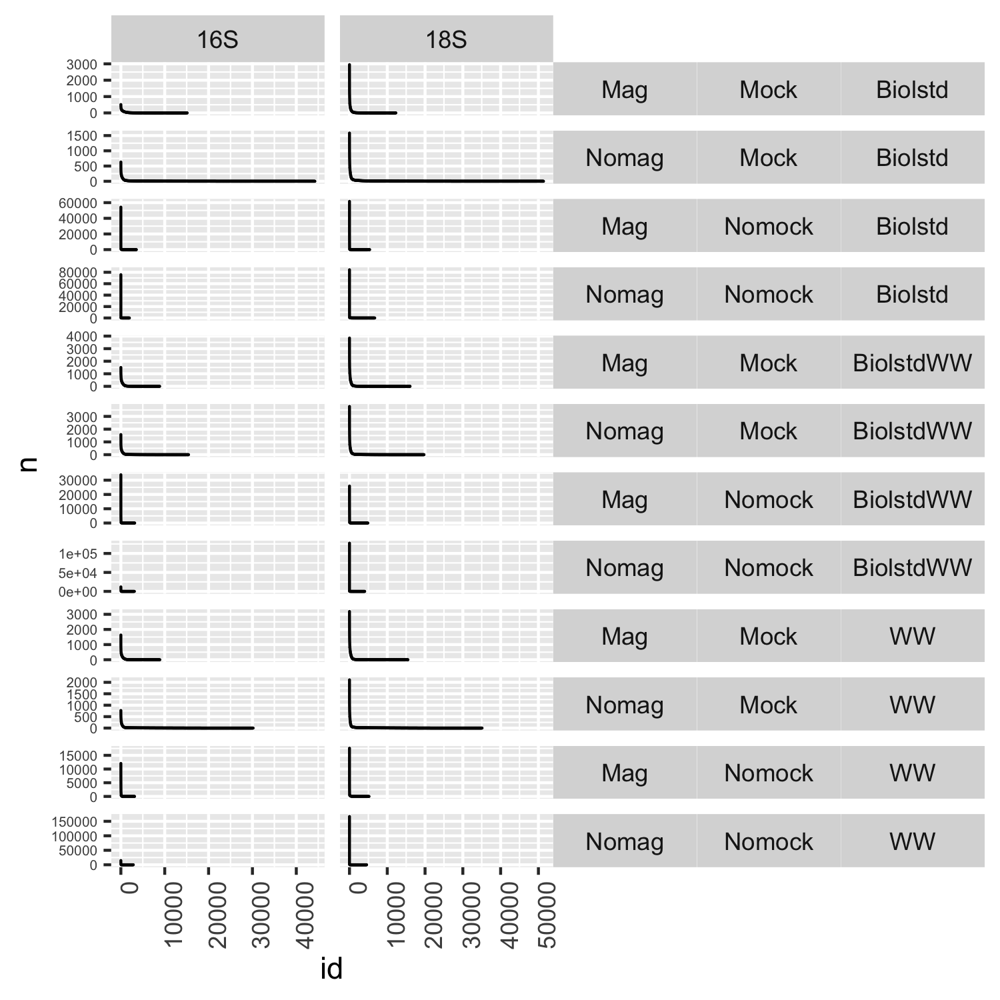
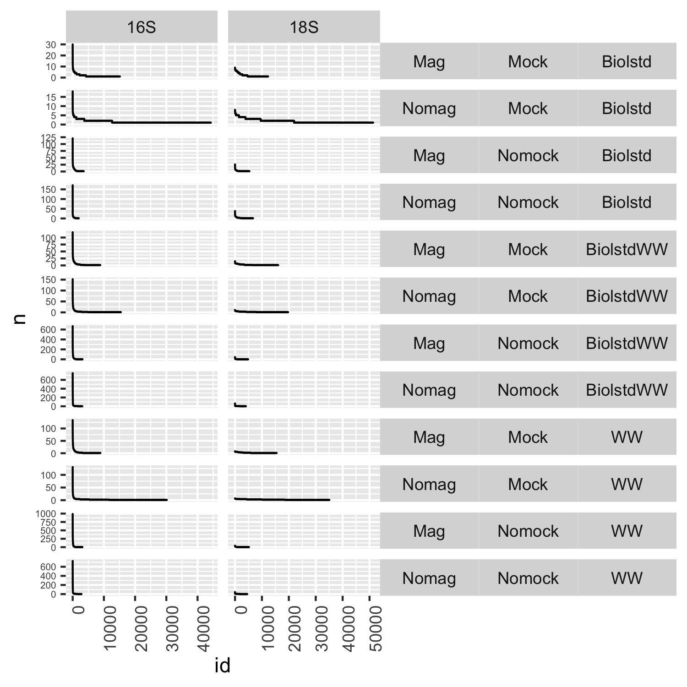
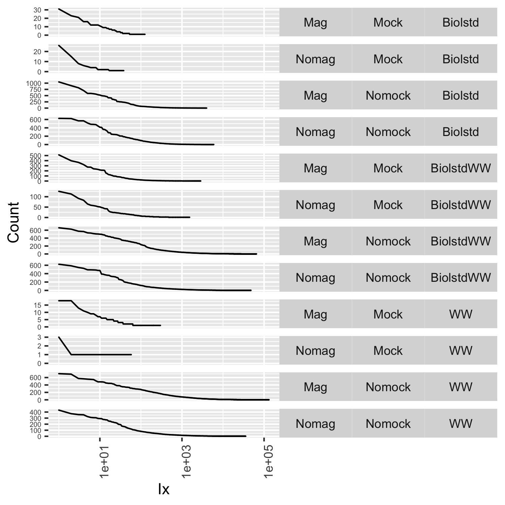
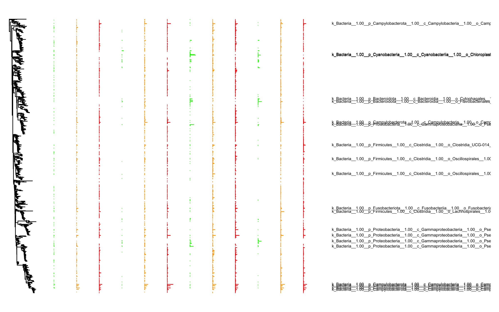
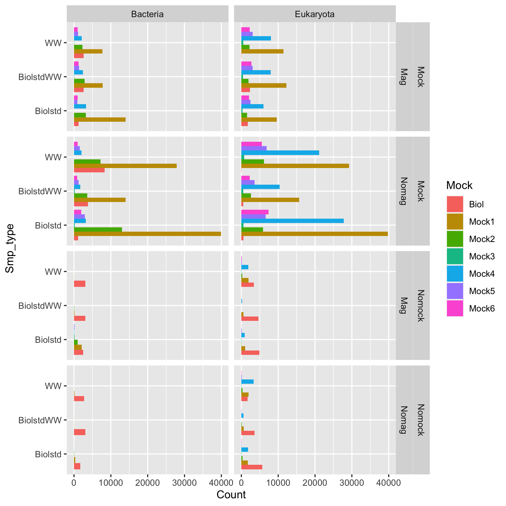
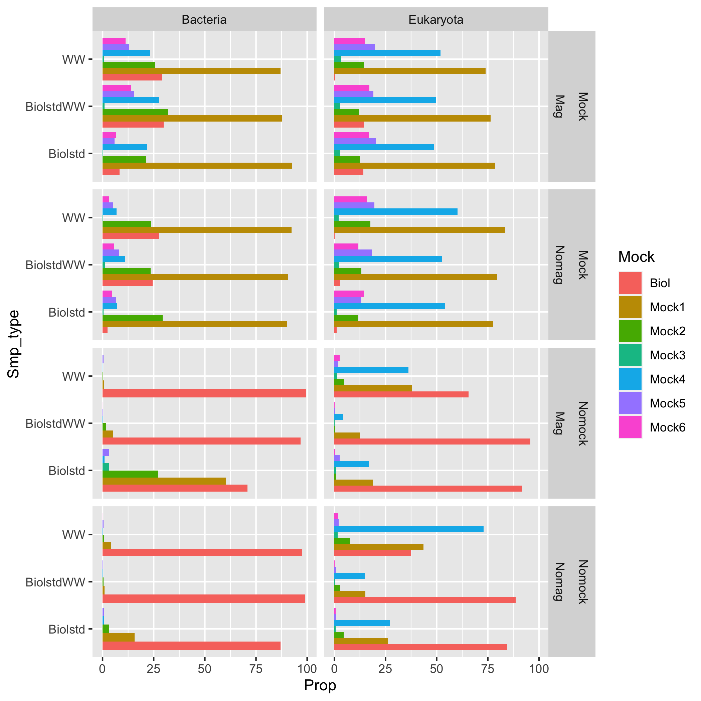
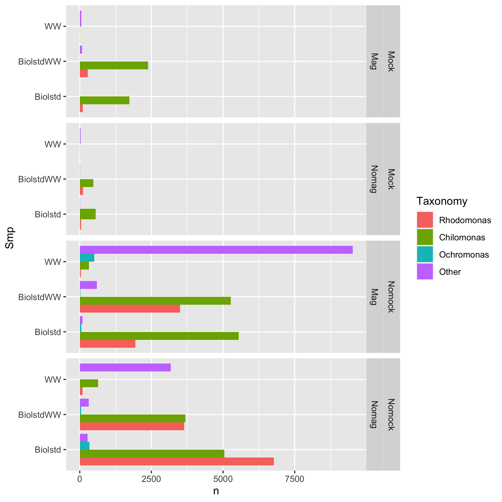

## Samples

-   BiolstdM100XDilBC10e4fluo: Biological standard-Fluorinated oil, 30
    000 standard copies
-   BiolstdM100XDilBC10e3fluo: Biological standard-Fluorinated oil, 3000
    standard copies
-   BiolstdM100XDilBC10e4mine: Biological standard-Mineral oil, 30 000
    standard copies
-   BiolstdM100XDilBC10e3mine: Biological standard-Mineral oil, 3000
    standard copies
-   WWBiolstdM100XDilBC10e4fluo: Wastewater + Biological
    standard-Fluorinated oil, 30 000 standard copies
-   WWBiolstdM100XDilBC10e3fluo: Wastewater + Biological
    standard-Fluorinated oil, 3000 standard copies
-   WWBiolstdM100XDilBC10e4mine: Wastewater + Biological
    standard-Mineral oil, 30 000 standard copies
-   WWBiolstdM100XDilBC10e3mine: Wastewater + Biological
    standard-Mineral oil, 3000 standard copies
-   WWM100XDilBC10e4fluo: Wastewater-Fluorinated oil, 30 000 standard
    copies
-   WWM100XDilBC10e3fluo: Wastewater-Fluorinated oil, 3000 standard
    copies
-   WWM100XDilBC10e4mine: Wastewater-Mineral oil, 30 000 standard copies
-   WWM100XDilBC10e3mine: Wastewater-Mineral oil, 3000 standard copies

## Barcode distributions

<table>
<tr>
<td>
Barcode distribution
</td>
<td>
Barcode taxonomy distribution
</td>
</tr>
<tr>
<td valign="top">

</td>
<td valign="top">

</td>
</tr>
</table>

## Distribution of connections

<td valign="top">

</td>

## Abundance profiles

The abundance columns are:

-   Only biological controls; 30 000 standard copies; 1e4 barcode
    molecules; mineral oil emulsion
-   WRhodoM100XDilBC10e5: Wastewater + biological controls; 30 000
    standard copies; 1e4 barcode molecules; mineral oil emulsion
-   Only wastewater; 30 000 standard copies; 1e4 barcode molecules;
    mineral oil emulsion
-   Only biological controls; 3000 standard copies; 1e4 barcode
    molecules; mineral oil emulsion
-   WRhodoM100XDilBC10e6: Wastewater + biological controls; 3000
    standard copies; 1e4 barcode molecules; mineral oil emulsion
-   Only wastewater; 3000 standard copies; 1e4 barcode molecules;
    mineral oil emulsion
-   Only biological controls; 30 000 standard copies; 1e4 barcode
    molecules; fluorinated oil emulsion
-   WRhodoM100XDilBC10e5: Wastewater + biological controls; 30 000
    standard copies; 1e4 barcode molecules; fluorinated oil emulsion
-   Only wastewater; 30 000 standard copies; 1e4 barcode molecules;
    fluorinated oil emulsion
-   Only biological controls; 3000 standard copies; 1e4 barcode
    molecules; fluorinated oil emulsion
-   WRhodoM100XDilBC10e6: Wastewater + biological controls; 3000
    standard copies; 1e4 barcode molecules; fluorinated oil emulsion
-   Only wastewater; 3000 standard copies; 1e4 barcode molecules;
    fluorinated oil emulsion

<td valign="top">

</td>
<td valign="top">

</td>

## Tanglegram of dil10mine

The abundance columns are:

-   Only biological controls; 30 000 standard copies; 1e4 barcode
    molecules; mineral oil emulsion
-   WRhodoM100XDilBC10e5: Wastewater + biological controls; 30 000
    standard copies; 1e4 barcode molecules; mineral oil emulsion
-   Only wastewater; 30 000 standard copies; 1e4 barcode molecules;
    mineral oil emulsion

Non-normalised connections
<td valign="top">

</td>
Normalised connections
<td valign="top">

</td>

## Tanglegram of dil100mine

The abundance columns are:

-   Only biological controls; 3000 standard copies; 1e4 barcode
    molecules; mineral oil emulsion
-   WRhodoM100XDilBC10e6: Wastewater + biological controls; 3000
    standard copies; 1e4 barcode molecules; mineral oil emulsion
-   Only wastewater; 3000 standard copies; 1e4 barcode molecules;
    mineral oil emulsion

Non-normalised connections
<td valign="top">

</td>
Normalised connections
<td valign="top">

</td>

## Tanglegram of dil10fluo

The abundance columns are:

-   Only biological controls; 30 000 standard copies; 1e4 barcode
    molecules; fluorinated oil emulsion
-   WRhodoM100XDilBC10e5: Wastewater + biological controls; 30 000
    standard copies; 1e4 barcode molecules; fluorinated oil emulsion
-   Only wastewater; 30 000 standard copies; 1e4 barcode molecules;
    fluorinated oil emulsion

Non-normalised connections
<td valign="top">

</td>
Normalised connections
<td valign="top">

</td>

## Tanglegram of dil100fluo

The abundance columns are:

-   Only biological controls; 3000 standard copies; 1e4 barcode
    molecules; fluorinated oil emulsion
-   WRhodoM100XDilBC10e6: Wastewater + biological controls; 3000
    standard copies; 1e4 barcode molecules; fluorinated oil emulsion
-   Only wastewater; 3000 standard copies; 1e4 barcode molecules;
    fluorinated oil emulsion

Non-normalised connections
<td valign="top">

</td>
Normalised connections
<td valign="top">

</td>

## Standard abundances

<table>
<tr>
<td>
Absolute mock abundances
</td>
<td>
Proportopnal mock abundances
</td>
</tr>
<tr>
<td valign="top">

</td>
<td valign="top">

</td>
</tr>
</table>
Absolute biological standard abundances
<td valign="top">

</td>

## OTU sampling frequency

<td valign="top">

</td>
