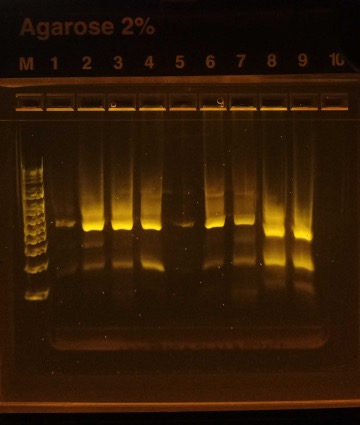
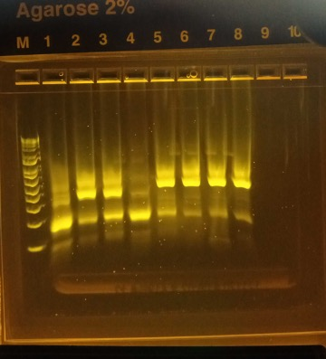
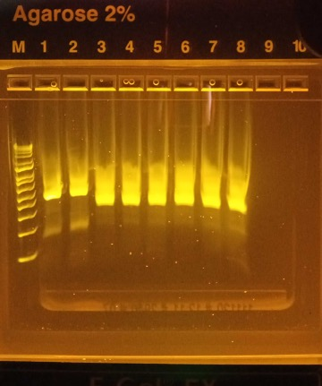

## Polyacrylamide bead formation

For each sample:

a) Combine the following reagents in a 2 ml round-bottom safe-lock microtube and vortex gently: 
- 120 µl sample material * 
- 80 µl 30% BIS/acrylamide (storage temp: 4 °C) 
- 25 µl 10% APS (storage temp: -20 °C)

*Samples:

1: Rhodomonas + Chilomonas + Ochromonas (Biological standard):
- The final cell density for approximately 40 000 cells/ml rhodomonas, 4 000 cells/ml chilomonas, and 400 cells/ml ochromonas
- 25 µl + 4 µl + 1 µl (respectively) + 90 µl PCR water

2: Wastewater (ww) + Rhodomonas + Chilomonas + Ochromonas:
- 90 µl + 25 µl + 4 µl + 1 µl (respectively)

3: Wastewater:
- 120 µl

b) Shake & mix STT emulsion oil* thoroughly before use!
- *) 2,25 ml Span 80 + 200 µl Tween 80 + 25 µl Triton X-100, Mineral oil to 50 ml.
- Add 600 µl STT emulsion oil. (storage temp: RT)
- Vortex at max speed (3 000 rpm) for 30 s.

c) Add 25 µl TEMED. (storage temp: RT)
- Vortex at max speed (3 000 rpm) for 30 s.

d) Allow tube to sit on the benchtop for polymerization to occur for 1h 30 min

e) Removal of oil:
- Equal volumes of water and diethyl ether (at least 50 % water!) mixed, shaken and opened occasionally to prevent pressure from building up.
- Add 800 µl of diethyl ether to the tube, then immediately close, invert and flick the tube to mix the emulsion with the ether. A visible precipitate ought to form. Draw off the ether/oil mixture around the precipitate and discard. The diethyl ether wash performed twice
- Add 1 ml of autoclaved H2O to the top of the tube and mix by flicking and inverting. Centrifuge for 30 s at 12 000rcf. Three layers should form: a bottom layer of beads, a middle cloudy layer of oil/water, and a top milky layer of oil. Draw off the top oil layer as much as possible and discard.
- Repeat the H2O wash steps until there is no remaining oil at the top of the tube and the liquid phase is transparent (at least 4 times).

f) The beads were suspended in 500 µl of PCR water and stored in 4°C

## Magnetic size selection

A similar set of samples as above, 20 µl of water was replaced by Dynabeads MyOne Streptavidin C1 -suspension at polymerization to make additional samples.

Magnetic size selection was performed after ethyl extraction as follows:

- Add autoclaved H2O so that the volume is about 2 ml and mix by flicking and inverting. Put the tube next to the magnet for 20 min. Draw off about 1 ml of bead suspension from the bottom of the tube, carefully avoiding the beads that are attracted to the side of the tube by the magnet. Add more water and repeat several times.
- The bead suspension can still be rinsed by repeated centrifugation and resuspension of the pellet. Also, the beads may be filtered through 40 µm strainer.

## Fusion PCR

Prepare the PCR master mix:
| Reagent | 1X | 6X |
| :---: | :---: | :---: |
| 5xGC buffer | 20 µl | 120 µl |
| 50 mM MgCl2 | 2 µl | 12 µl |
| dNTP mix (10 mM each) | 2.5 µl | 15 µl |
| 10 µM R2 and F1 primers (3, each) | 10 µl | 60 µl |
| 10 µM R1-F2’ and F2-R1' primers (4, each)  | 1 µl | 6 µl |
| Phusion DNA polymerase (2 U/µl) | 8 µl | 48 µl |

a) Add 3-5 glass beads to the tubes and 66/67 µl of master mix. Add 33 µl of sample beads. With the 66 µl mastermix, add 1 µl of “mock mix”, synthetic control (DNA molecules that work like the targeted real 16S and 18S sequences). These reactions will have up to 3e5 control molecules.

b) Add 900 µl of 4% Abil Em90 in mineral oil to each tube -> vortex for 1 min and distribute 100-120µl of each sample to 7-8 wells of 8-well strips.

c) Running PCR:

| Step | Temperature (°C) | Time | Number of cycles |
| :---: | :---: | :---: | :---: |
| Beginning temperature | 80 | 10 s | 1 |
| Initial denaturation | 94 | 30 s | 1 |
| Denaturation | 94 | 5 s | 32 |
| Annealing | 55 | 30 s | 
| Extension | 72 | 30 s | 
| Final extension | 72 | 5 min | 1 |
| Storing temperature | 4 | Inf | 1 |

d) Break abil emulsion:
- Add 1 ml of diethyl ether -> vortex -> centrifuge 1 min 13000rcf -> draw off the top phase
- 50 µl of H2O -> repeat previous step
- Add 500 µl of ethyl acetate -> vortex -> spin -> draw off the top phase
- 2 x diethyl ether washes: Add 1ml -> tapping -> draw off the top phase and leave the tube cap open
- Leave tubes open for extra 5 mins to evaporate the ether
- Transfer the bottom phase (100 µl) to a new tube 

e) Cleanup with Monarch® PCR & DNA Cleanup Kit (5 μg)

## 16S and 18S blocking

Prepare the PCR master mix:
| Reagent | 1X | 6X |
| :---: | :---: | :---: |
| PCR H2O | 23.5 µl | 141 µl |
| 5xGC buffer | 10 µl | 60 µl |
| dNTP mix (10 mM each) | 1 µl | 6 µl |
| 32 µM BlockF-16S and BlockR-16S primers | 5 µl | 30 µl |
| 32 µM BlockF-18S and BlockR-18S primers | 5 µl | 30 µl |
| Phusion DNA polymerase (2 U/µl) | 0.5 µl | 3 µl |

Pipette 45 µl mastermix and 5 µl template (purified fusion PCR product).

Running PCR:
| Step | Temperature (°C) | Time | Number of cycles |
| :---: | :---: | :---: | :---: |
| Beginning temperature | 98 | 30 s | 1 |
| Denaturation | 98 | 10 s | 30 |
| Annealing | 55 | 30 s | 
| Extension | 72 | 30 s | 
| Final extension | 72 | 5 min | 1 |
| Storing temperature | 4 | Inf | 1 |

Cleanup with Monarch® PCR & DNA Cleanup Kit (5 μg).

## Nested PCR

Prepare 2 PCR master mixes (with either 16S and 18S nested primers), 4x reactions per sample:

| Reagent | 1X | 25X |
| :---: | :---: | :---: |
| PCR H2O | 14.75 µl | 368.75 µl |
| 5xGC buffer | 5 µl | 125 µl |
| dNTP mix (10 mM each) | 0.5 µl | 12.5 µl |
| Primer mix * either 16S or 18S | 2.5 µl | 62.5 µl |
| Phusion DNA polymerase (2 U/µl) | 0.25 µl | 6.25 µl |

(*) Primer mixes:
- 16S: 16S nested primers (4 primers), i5 forward, BlockF, BlockR; (3µM each)
- 18S: 18S nested primers (4 primers), i5 forward, BlockF, BlockR; (3µM each)

Combine 23 µl mastermix + 2 µl of sample (from blocking PCR), 4 replicates each sample

Running PCR:

| Step | Temperature (°C) | Time | Number of cycles |
| :---: | :---: | :---: | :---: |
| Beginning temperature | 98 | 30 s | 1 |
| Denaturation | 98 | 10 s | 24 |
| Annealing | 55 | 30 s | 
| Extension | 72 | 30 s | 
| Final extension | 72 | 5 min | 1
| Storing temperature | 4 | Inf | 1

Replicate samples pooled and cleanup with Monarch® PCR & DNA Cleanup Kit (5 μg).

## Indexing

16S and 18S barcoding experiments were further prepared for sequencing using indexing primers.

Prepare following PCR mix :

| Reagent | 1X | 100X |
| :---: | :---: | :---: |
| H2O | 12,4 µl | 1240 µl |
| 5x HF buffer | 4 µl | 400 µl |
| dNTP mix (10 mM each) | 0,4 µl | 40 µl |
| Phusion DNA polymerase (2 U/µl) | 0,2 µl | 20 µl |
| i5 primer (10 µM) | 1 µl | - |
| i7 primer (10 µM) | 1 µl | - |

Pipette 17 µl mastermix, 1 µl of appropriate primers each, and 1 µl template (purified nested PCR product) to 4 PCR tubes per sample

Primers were N701, N702, N703, S502, S503, S505, S506, S507, S508, S510, and S511

Run the following cycling program:

| Step | Temperature (°C) | Time | Number of cycles |
| :---: | :---: | :---: | :---: |
| Beginning temperature | 98 | 30 s | 1 |
| Denaturation | 98 | 10 s | 12 |
| Annealing | 55 | 20 s | 
| Extension | 72 | 20 s | 
| Final extension | 72 | 5 min | 1 |
| Storing temperature | 4 | Inf | 1 |

Pool replicate reactions, mix, and load 20 µl to a gel. Excise the correct-sized product and purify with Monarch® PCR & DNA Cleanup Kit (5 μg) and gel dissolving buffer. (Agarose gel casket: Invitrogen E-Gel® EX with SYBR® Gold II, 2% agarose, program: E-Gel EX 1–2% (10 mins))

<td valign="top"></td>

<td valign="top"></td>

<td valign="top"></td>

Samples in order from left to right:

top:

- 16S RCO (rhodomonas, chilomonas, ochromonas)
- 16S RCO ww
- 16S ww
- 16S RCO mag
- error applying sample
- 16S RCO ww mag
- 16S ww mag
- 18S RCO
- 18S RCO ww

middle:

- 18S ww
- 18S RCO mag
- 18S RCO ww mag
- 18S ww mag
- 16S RCO mocks
- 16S RCO ww mocks
- 16S ww mocks
- 16S RCO mag mocks

bottom:

- 16S RCO ww mag mocks
- 16S ww mag mocks
- 18S RCO mocks
- 18S RCO ww mocks
- 18S ww mocks
- 18S RCO mag mocks
- 18S RCO ww mag mocks
- 18S ww mag mocks

## Sample pooling and sequencing

The DNA concentration of the purified PCR products was measured by Qubit, a library was created by combining the products in equal DNA amounts, and the DNA concentration of the resulting mix was measured again for confirmation (2,3 ng/µl, which is 10,5 nM here).

The library was diluted to 4 nM using elution buffer (Qiagen).

Preparing the library for sequencing:

a) Prepare a Fresh Dilution of NaOH:
- Combine the following volumes in a microcentrifuge tube: Laboratory-grade water (16 μl) + Stock 1.0 N NaOH (4 μl)
- Invert the tube several times to mix.

b) Prepare HT1
- Remove HT1 from -25°C to -15°C storage and thaw at room temperature.
- Store at 2°C to 8°C until you are ready to dilute denatured libraries.

c) Denature a 4 nM Library :
- Combine the following volumes in a microcentrifuge tube: 4 nM library (5 μl) + 0.2N NaOH (5 μl)
- Vortex briefly and then centrifuge at 280 × g for 1 minute.
- Incubate at room temperature for 5 minutes.

d) Add 990 μl prechilled HT1 to the tube containing denatured library. The result is 1 ml of a 20 pM denatured library.

e) Dilute Denatured 20 pM Library:
- Dilute to 6pM using the following volumes: 20 pM library (180 μl) + Prechilled HT1 (420 μl)
- Invert to mix and then pulse centrifuge.

The sample was loaded into the cassette and the sequencing was performed in the Turku Bioscience facilities, using Illumina's MiSeq.
